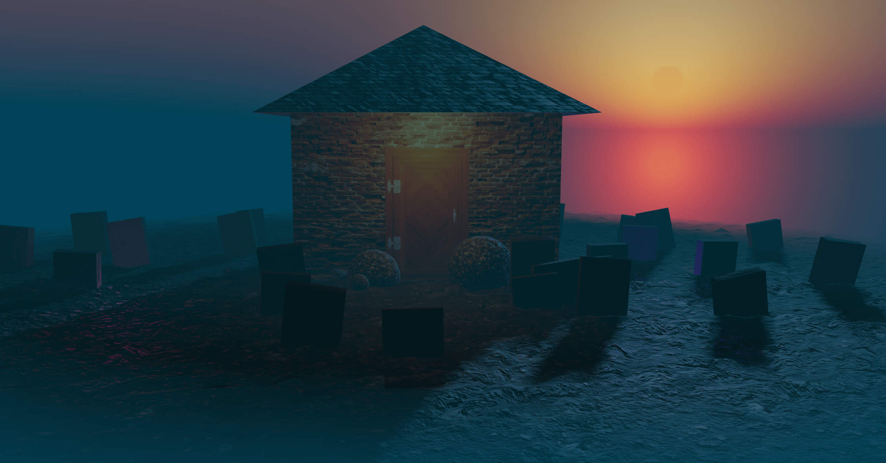

# 3D Haunted House — TypeScript Refactor



🔗 **Live Demo:** [haunted-house-ts.vercel.app](https://haunted-house-ts.vercel.app)

A Three.js haunted house scene originally built from the **Three.js Journey** course and refactored into a **class-based, TypeScript architecture**.

This project focuses on restructuring a tutorial scene into a more maintainable, modular real-time 3D application.

---

## Tech Stack

- Three.js
- TypeScript (strict mode)
- Vite

---

## What Was Refactored

- Scene split into modular classes (House, Graves, Ghosts, Sky, Fog, Lights)
- Central `Experience` class managing lifecycle, render loop, and resize handling
- `World` class responsible for scene composition
- Resource loading system with ready events
- Strong typing for materials, textures, and shader uniforms
- Update loop separation for animated systems

---

## Features

- PBR textured floor (AO, normal, displacement maps)
- Animated ghost lights
- Procedural sky and fog
- Responsive canvas + OrbitControls

---

## Getting Started

```bash
npm install
npm run dev
```
